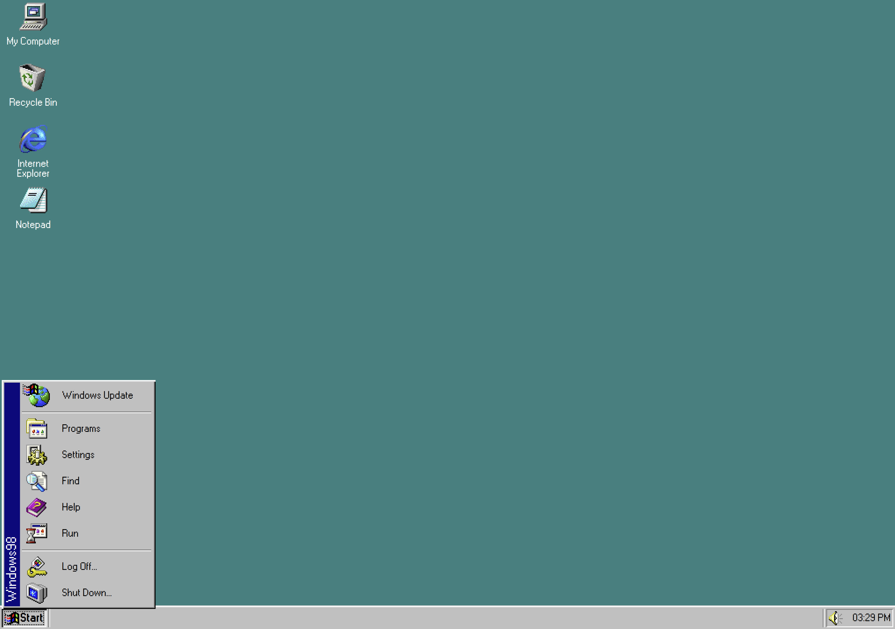

#  win98
Windows 98 recreation attempt using TypeScript and React.



##  Live Demo
[Check out live demo on Github Pages](https://zabdalimov.github.io/win98).

##  Getting Started
To run project locally:
```shell
yarn # install dependencies
yarn start # start web server
```

After web server is started, go to http://localhost:3000 to see your Windows 98 desktop.

##  Resources / Credits
|               |                                                   |
| ------------- | ------------------------------------------------- |
| Icons         | https://win98icons.alexmeub.com                   |
| Fonts         | https://fontsarena.com/w95fa-by-fontsarena        |
|               | https://dafont.com/perfect-dos-vga-437.font       |
| Sounds        | https://101soundboards.com                        |
| Emulator      | https://copy.sh/v86/?profile=windows98            |